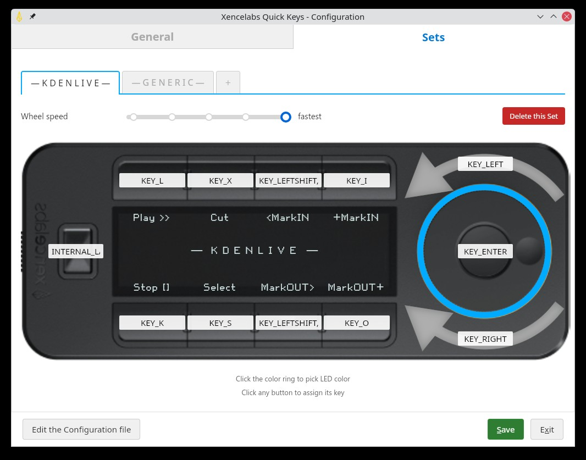

# Xencelabs Quick Keys Driver & GUI Configurator for Linux

A lightweight, userland driver for the Xencelabs Quick Keys remote, written in Go. All configuration is done through an interactive GUI.



[Screenshots](screenshots/)

## Features

- **Full Remapping:** Map buttons and the wheel to any keyboard combination.
- **Layer Support:** Create multiple layers (e.g., General, DaVinci, Blender) and cycle through them.
- **Visual Key Assignment:** Integrated reference table for key codes.
- **Label Simulation:** Dynamic display of labels on the device screen.
- **Integrated Config Editor:** Built-in YAML configuration file editor with syntax validation.
- **Device Orientation Indicator:** Visual preview of the device orientation (0°, 90°, 180°, 270°).
- **Configurable Startup Set:** Choose which layer to load on startup.
- **Keyboard Layout:** QWERTY or AZERTY layout selection.
- **Battery on Device:** Option to display battery level directly on the device screen.
- **Systray Icon:** Status indicator in the system tray with quick access to the configuration window.
- **OLED Control:** Custom text labels per button and temporary text overlays when switching layers.
- **LED Control:** Custom colored LED ring per layer.
- **Wheel Settings:** Configurable sensitivity/speed per layer.
- **Battery Monitoring:** Reports battery percentage to the log.

## Prerequisites

You need the C headers for USB and HID libraries to compile the project.

**Debian/Ubuntu:**
```bash
sudo apt install libusb-1.0-0-dev libudev-dev pkg-config
```

## Installation

1. **Clone the repository** (or create the files):
   ```bash
   go build .
   ```

### Build options

- **Basic** (no systray): `go build .`
- **With systray + Wails GUI** (recommended): `make build-tray` or `wails build -tags "tray,webkit2_41,wails"`
  - **Important:** the `wails` tag is required (uses slytomcat/systray, DBus only, no GTK conflict)
  - Systray icon with status, layer, battery; "Configure..." menu opens the Wails window
  - Wails window (HTML/JS) to edit the configuration
  - Option `-show-gui` or `--show-gui`: show the configuration window on startup
  - Wails dependencies on Linux: `sudo apt install libgtk-3-dev libwebkit2gtk-4.1-dev`
  - Systray: if the icon does not appear (older GNOME), install `snixembed` or a StatusNotifierItems proxy
  - Ubuntu 24.04+: use the `webkit2_41` tag (WebKitGTK 4.1)
  - Wails CLI: `go install github.com/wailsapp/wails/v2/cmd/wails@latest`

## Configuration (`config.yaml`)

The behavior of the device is defined in `config.yaml`.

### Button Layout
```text
[0]  [1]
[2]  [3]
[4]  [5]
[6]  [7]

[8] = Physical button 
[9] = Wheel Center Click
```

### Example Config Fragment
```yaml
device:
  brightness: medium      # off, low, medium, full
  orientation: 0          # 0, 90, 180, 270
  wheel_speed: normal     # global default
  overlay_duration: 2     # seconds
  keyboard_layout: azerty # qwerty or azerty (fr-FR)

layers:
  - name: "General"
    color: { r: 192, g: 192, b: 192 } # Light gray ring
    wheel_speed: fastest            # Override speed for this layer
    buttons:
      0:
        label: "Copy"
        keys: ["KEY_LEFTCTRL", "KEY_C"]
      8:
        label: "Layer"
        keys: ["INTERNAL_LAYER_CYCLE"] # Special command to switch layers
    wheel:
      left: ["KEY_VOLUMEDOWN"]
      right: ["KEY_VOLUMEUP"]
```

## Wireless Mode

If you use the Quick Keys **wirelessly** (USB dongle) and the OLED screen displays "Please connect the computer and install driver", the remote is **not yet paired** with the dongle.

**Pairing required (one-time):**
1. Connect the Quick Keys to the PC **with the USB cable** (not the dongle)
2. On a **Windows or Mac** PC, install the official Xencelabs driver
3. Open the Xencelabs application → Settings (gear icon) → "Manage Wireless Pairing"
4. Plug in the USB dongle, then pair the remote with the dongle
5. Once paired, the Quick Keys will work wirelessly with this Linux driver

**Alternative:** Use the Quick Keys in **wired mode** by connecting it directly to the PC with the USB cable. No pairing required.

## Running the Driver

### 1. Udev Rules (Required)
Allow non-root access to the raw HID device. Create `/etc/udev/rules.d/50-xencelabs.rules`:

See the example file in the repo.

Reload rules: `sudo udevadm control --reload-rules && sudo udevadm trigger`

### 2. Manual Run
Since this driver creates a virtual keyboard, it requires access to `/dev/uinput`.

```bash
./xencelabs-quick-keys
```

### 3. System Installation (automatic startup)

```bash
# Build and install the binary + systemd service
make install

# Install udev rules (requires sudo)
sudo make udev

# IMPORTANT: allow user services to start at boot (without login)
loginctl enable-linger $USER

# Enable the service
systemctl --user daemon-reload
systemctl --user enable --now xencelabs-quick-keys
```

Without `loginctl enable-linger`, the service only starts at graphical login. With linger, it starts at boot.

Useful commands:
- `systemctl --user status xencelabs-quick-keys` — service status
- `journalctl --user -u xencelabs-quick-keys -f` — view logs in real time

## Supported Key Codes

Use standard Linux input event codes in `config.yaml`. Common examples:

- `KEY_A` ... `KEY_Z`
- `KEY_1` ... `KEY_0`
- `KEY_F1` ... `KEY_F12`
- `KEY_LEFTCTRL`, `KEY_LEFTSHIFT`, `KEY_LEFTALT`, `KEY_LEFTMETA` (Windows/Command)
- `KEY_ENTER`, `KEY_ESC`, `KEY_TAB`, `KEY_SPACE`, `KEY_BACKSPACE`
- `KEY_UP`, `KEY_DOWN`, `KEY_LEFT`, `KEY_RIGHT`
- `KEY_PAGEUP`, `KEY_PAGEDOWN`, `KEY_HOME`, `KEY_END`
- `KEY_VOLUMEDOWN`, `KEY_VOLUMEUP`, `KEY_MUTE`

## Debug

To diagnose inputs (e.g. wheel center button):
```bash
XENCELABS_DEBUG=1 ./xencelabs-quick-keys
```
Displays k1, k2, wheel in hex on each press.

## Known Bugs

The overlay showing the current layer may require testing; improvements added (delays, full 32-char support).

## Acknowledgments

- Base code inspired by the work of [akhenakh](https://github.com/akhenakh/xencelabs-quick-keys-go).
- The graphical interface uses [Wails](https://wails.io/), a framework for building desktop applications with Go and web technologies.
- All development was done with [Cursor AI](https://cursor.com/).

## Tested Environment

The driver has been tested and is fully functional on **Ubuntu 25.10** with **KDE Plasma 6**.
